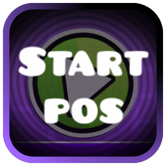

  

      
  

  <h1>Level Startpos</h1>
  </img>  
  <a href="https://discord.gg/yvvJW2z9zB"></img></a>  
  </img>  

## About  
**Level Startpos** is a simple and useful mod for **Geometry Dash**. It adds a button in LevelInfoLayer that redirects you to startpos version of the level.

## Features  
- Adds a button in LevelInfoLayer if startpos version of level exists. 
- Fetches all levels through special **JSON link**.
- Automatically refresh data of levels ( you can disable / configure time of it in **mod settings** ).

## Installation  
1. Install [**Geode**](https://geode-sdk.org) if you haven't already.  
2. Download the latest version of **Level Startpos** from the [Releases](https://github.com/noxygalaxy/level-startpos/releases) page.  [Direct Download](https://github.com/noxygalaxy/level-startpos/releases/latest/download/noxygalaxy.pause_countdown.geode)
3. Place the downloaded `.geode` file into your Geometry Dash mods folder.  

## Support  
If you encounter any issues, please report them on the [Issues](https://github.com/noxygalaxy/level-startpos/issues) page. You can also join our **Discord** for help, discussions and to see my new mod releases <3  

## Credits
- @noxygalaxy - owner of the mod
- @GlowRock03 - i used his download delegate system

<a href="https://discord.gg/yvvJW2z9zB"></img></a>  